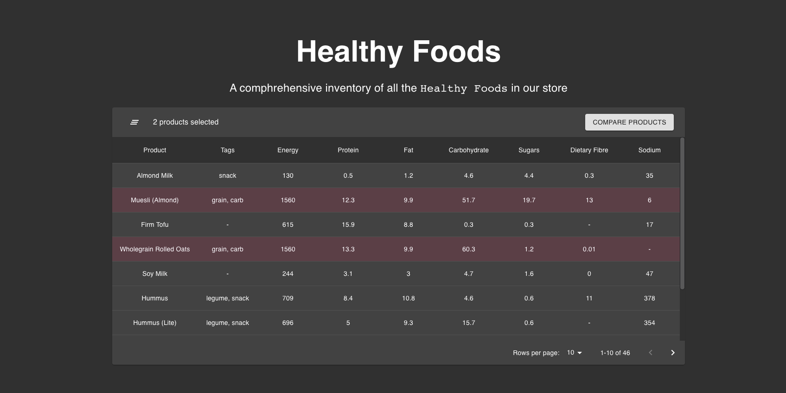
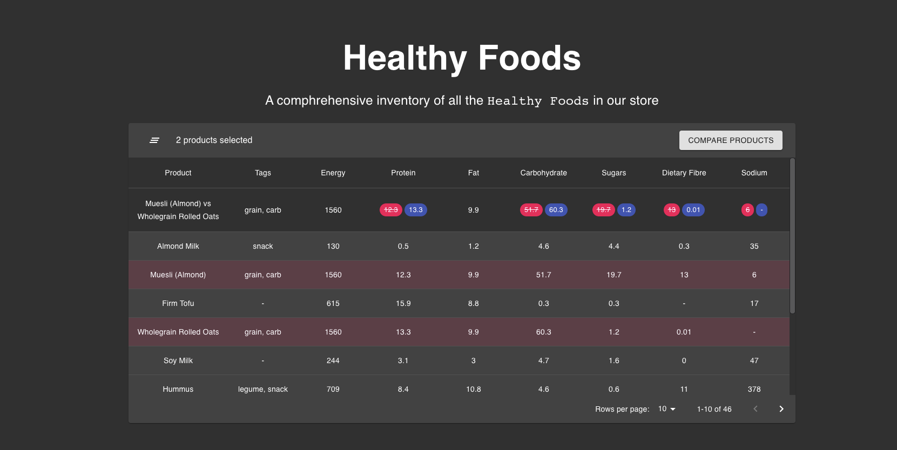

### Compare products

The user is able to select multiple products. When two products are selected, a "Compare products" button showed up similarly to the screenshot below:



When the user presses the "Compare products" button, a new table row appears at the top containing a diff between the nutrition information for the selected products. Here's another screenshot for reference:



It worked similarly to `git diff` functionality:
- the product selected first will show the nutrition values in red with a strikethrough content;
- the product selected second will show the nutrition values in a positive color: blue, green, etc.

Notes:
- the content of the cell remain unchanged if the nutrition info is the same for both products (e.g.: same amount of protein);
- the name and tags columns can be ignored for the comparision.

## Building the project

Please make sure you meet the [Next.js system requirements](https://nextjs.org/docs#system-requirements)

Enter the folder and run the development server with:

```bash
npm run dev
# or
yarn dev
```

Open [http://localhost:3000](http://localhost:3000) with your browser to see the project.
